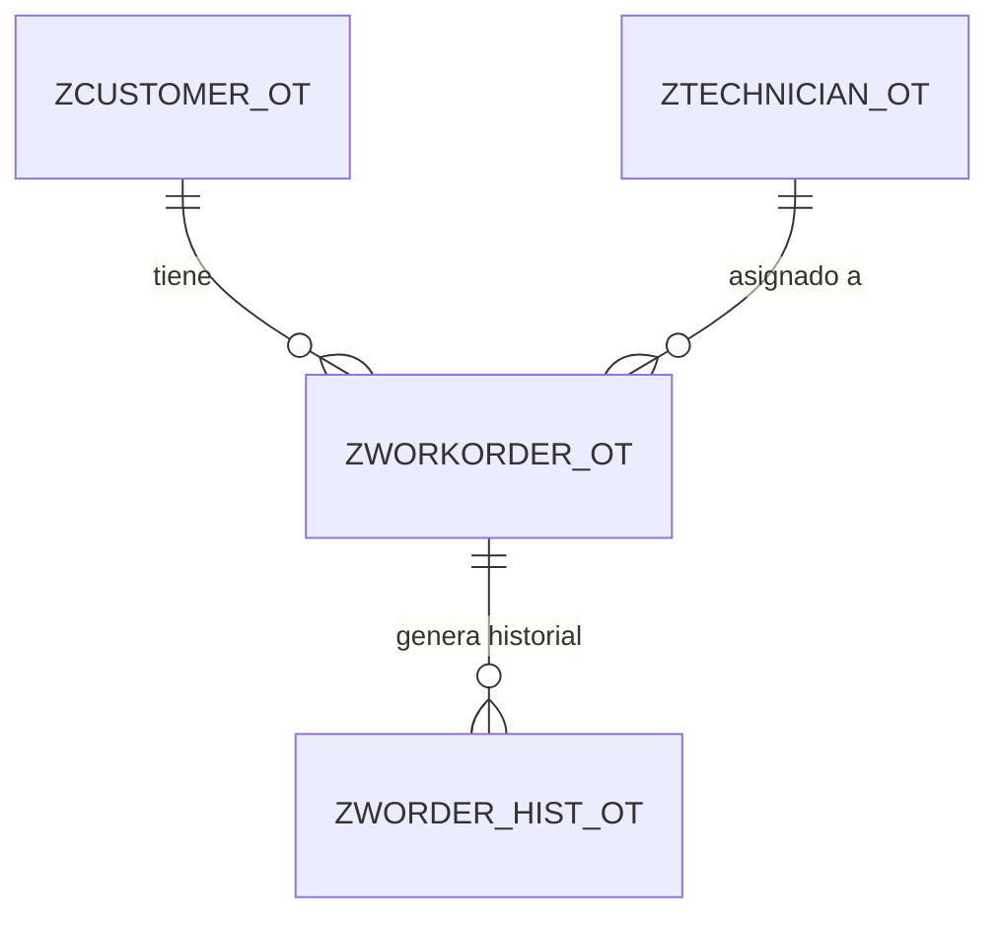

# Gestión de Órdenes de Trabajo en ABAP Cloud 🛠️

Proyecto final desarrollado en **ABAP Cloud**, orientado a la gestión de órdenes de trabajo mediante un modelo de datos propio, lógica de negocio, validaciones, autorizaciones y auditoría de cambios.

---

## 📋 Descripción general

Este repositorio contiene una solución ABAP para administrar órdenes de trabajo, incluyendo:

- mantenimiento de datos maestros
- creación, consulta, actualización y eliminación de órdenes
- validaciones de negocio
- control de autorizaciones
- historial de modificaciones
- preparación de datos iniciales para pruebas

La solución está organizada mediante objetos del **ABAP Dictionary**, clases ABAP y objetos de seguridad/autorización compatibles con el entorno de desarrollo versionado con **abapGit**.

---

## 🎯 Objetivo del proyecto

El objetivo de este proyecto es construir una solución integral para la gestión de órdenes de trabajo que permita:

- registrar clientes y técnicos
- crear órdenes de trabajo asociadas
- validar reglas funcionales antes de persistir cambios
- controlar operaciones según autorizaciones
- registrar trazabilidad de actualizaciones

---

## 🏗️ Estructura funcional del sistema

Las entidades principales del sistema son:

- **Clientes** (`ZCUSTOMER_OT`)
- **Técnicos** (`ZTECHNICIAN_OT`)
- **Órdenes de trabajo** (`ZWORKORDER_OT`)
- **Historial de órdenes** (`ZWORDER_HIST_OT`)

### Relación lógica entre entidades



---

## 📦 Estructuras técnicas del repositorio

### 1. Paquete ABAP

- `package.devc.xml`

Corresponde al paquete principal que agrupa los objetos del desarrollo.

---

### 2. Tablas transparentes

Estas tablas representan el núcleo del modelo de datos:

- `ZCUSTOMER_OT` → maestro de clientes
- `ZTECHNICIAN_OT` → maestro de técnicos
- `ZWORKORDER_OT` → órdenes de trabajo
- `ZWORDER_HIST_OT` → historial de cambios de órdenes

---

### 3. Elementos de datos

Se utilizan para tipar campos relevantes del modelo:

- `ZDE_CUSTOMER_ID_YZ`
- `ZDE_PRIORITY_YZ`
- `ZDE_STATUS_YZ`
- `ZDE_TECHNICIAN_ID_YZ`
- `ZDE_WORKORDER_ID`

---

### 4. Dominios

Definen las características técnicas y valores asociados a los tipos de datos:

- `ZDO_CUSTOMER_ID`
- `ZDO_PRIORITY_YZ`
- `ZDO_STATUS_YZ`
- `ZDO_TECHNICIAN_ID`
- `ZDO_WORKORDER_ID`

---

### 5. Objeto de bloqueo

Para control de concurrencia se incluye:

- `EZWORKORDER_YZ`

Este objeto está asociado al manejo de bloqueos sobre órdenes de trabajo para evitar inconsistencias en accesos simultáneos.

---

### 6. Clases ABAP

#### `ZCL_WORK_ORDER_CRUD_HANDLER_YZ`
Clase principal encargada de la lógica CRUD de órdenes de trabajo.

Responsabilidades:
- crear órdenes
- consultar órdenes existentes
- actualizar órdenes
- eliminar órdenes según reglas funcionales
- registrar historial cuando corresponde

#### `ZCL_WORK_ORDER_VALIDATOR_YZ`
Clase de validación de negocio.

Responsabilidades:
- validar existencia de cliente
- validar existencia de técnico
- validar prioridad
- validar estado permitido para actualización o borrado
- reforzar reglas de consistencia antes de ejecutar operaciones

#### `ZCL_LOAD_MASTER_DATA_YZ`
Clase de carga de datos maestros iniciales.

Responsabilidades:
- insertar datos base de clientes
- insertar datos base de técnicos
- facilitar pruebas funcionales del sistema

#### `ZCL_WORK_ORDER_CRUD_TEST_YZ`
Clase utilizada para pruebas funcionales del flujo CRUD.

Incluye escenarios de:
- creación
- lectura
- actualización
- validación de restricciones de eliminación

Además, el repositorio incluye:

- `ZCL_WORK_ORDER_CRUD_TEST_YZ.CLAS.TESTCLASSES.ABAP`

que complementa la estructura de pruebas asociadas.

---

## ⚙️ Funcionalidades implementadas

### CRUD de órdenes de trabajo

El sistema permite:

- crear nuevas órdenes
- consultar órdenes registradas
- actualizar órdenes existentes
- eliminar órdenes únicamente cuando cumplen las condiciones definidas

### Validaciones de negocio

Se controlan reglas como:

- el cliente debe existir
- el técnico debe existir
- la prioridad debe ser válida
- solo ciertas órdenes pueden modificarse según su estado
- no se debe eliminar una orden con historial registrado

### Auditoría de cambios

Cada actualización relevante puede dejar trazabilidad en:

- `ZWORDER_HIST_OT`

Esto permite consultar el historial de modificaciones realizadas sobre una orden.

### Preparación de datos maestros

Se facilita la carga inicial de datos para pruebas mediante:

- `ZCL_LOAD_MASTER_DATA_YZ`

---

## 🔐 Seguridad y autorizaciones

El repositorio incluye objetos relacionados con autorización y catálogo de acceso:

- `ZOT_AUT_YZ.suso.xml`
- `ZOT_AUT_YZ.sia3.xml`
- `ZWO_CRUD_CATALOG.sia1.xml`
- `ZWO_CRUD_CATALOG_0001.sia7.xml`
- `ZWO_CRUD_IAM_APP_YZ_EXT.sia6.xml`

Estos objetos soportan el control de acceso a operaciones del sistema y forman parte de la configuración de seguridad del desarrollo.

### Actividades controladas

De forma funcional, las operaciones contempladas son:

- `01` Crear
- `02` Modificar
- `03` Visualizar
- `06` Eliminar

---

## 🧪 Pruebas

La validación funcional del proyecto se apoya principalmente en:

- `ZCL_WORK_ORDER_CRUD_TEST_YZ`

Flujo cubierto:
1. creación de orden
2. lectura de orden creada
3. actualización de orden
4. verificación de historial
5. validación de restricción de borrado

---

## 📁 Estructura del repositorio

```text
/
├── .abapgit.xml
├── README.md
└── src/
    ├── ezworkorder_yz.enqu.xml
    ├── package.devc.xml
    ├── zcl_load_master_data_yz.clas.abap
    ├── zcl_load_master_data_yz.clas.xml
    ├── zcl_work_order_crud_handler_yz.clas.abap
    ├── zcl_work_order_crud_handler_yz.clas.xml
    ├── zcl_work_order_crud_test_yz.clas.abap
    ├── zcl_work_order_crud_test_yz.clas.testclasses.abap
    ├── zcl_work_order_crud_test_yz.clas.xml
    ├── zcl_work_order_validator_yz.clas.abap
    ├── zcl_work_order_validator_yz.clas.xml
    ├── zcustomer_ot.tabl.xml
    ├── zde_customer_id_yz.dtel.xml
    ├── zde_priority_yz.dtel.xml
    ├── zde_status_yz.dtel.xml
    ├── zde_technician_id_yz.dtel.xml
    ├── zde_workorder_id.dtel.xml
    ├── zdo_customer_id.doma.xml
    ├── zdo_priority_yz.doma.xml
    ├── zdo_status_yz.doma.xml
    ├── zdo_technician_id.doma.xml
    ├── zdo_workorder_id.doma.xml
    ├── zot_aut_yz.sia3.xml
    ├── zot_aut_yz.suso.xml
    ├── ztechnician_ot.tabl.xml
    ├── zwo_crud_catalog.sia1.xml
    ├── zwo_crud_catalog_0001.sia7.xml
    ├── zwo_crud_iam_app_yz_ext.sia6.xml
    ├── zworder_hist_ot.tabl.xml
    └── zworkorder_ot.tabl.xml
```

---

## 🚀 Tecnologías utilizadas

- **ABAP Cloud**
- **ABAP Dictionary**
- **abapGit**
- objetos de autorización/IAM
- clases ABAP orientadas a lógica de negocio

---

## 📌 Estado actual

El proyecto actualmente cuenta con:

- modelo de datos definido
- estructuras de diccionario completas
- lógica CRUD principal
- validaciones funcionales
- control de autorizaciones
- historial de cambios
- clases de prueba
- carga de datos maestros

---

## 👩‍💻 Autora

**Yesenia Zapata**

Proyecto académico: **ABAP Cloud I - Desde cero a avanzado**
